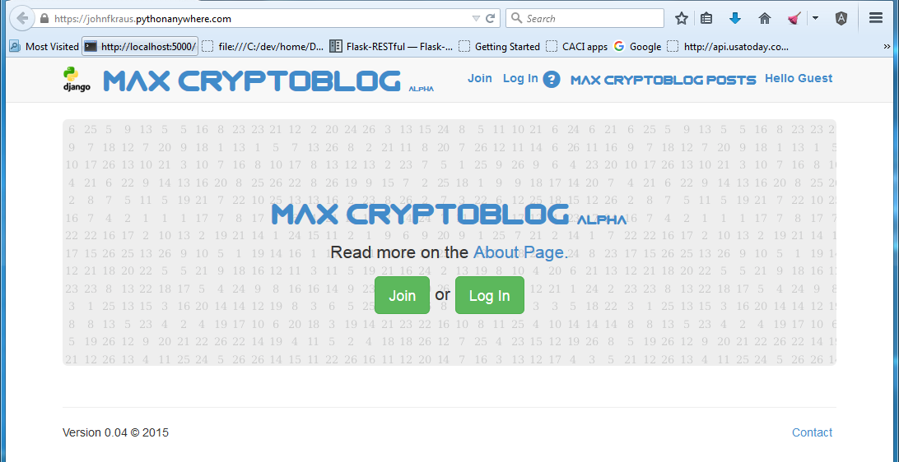
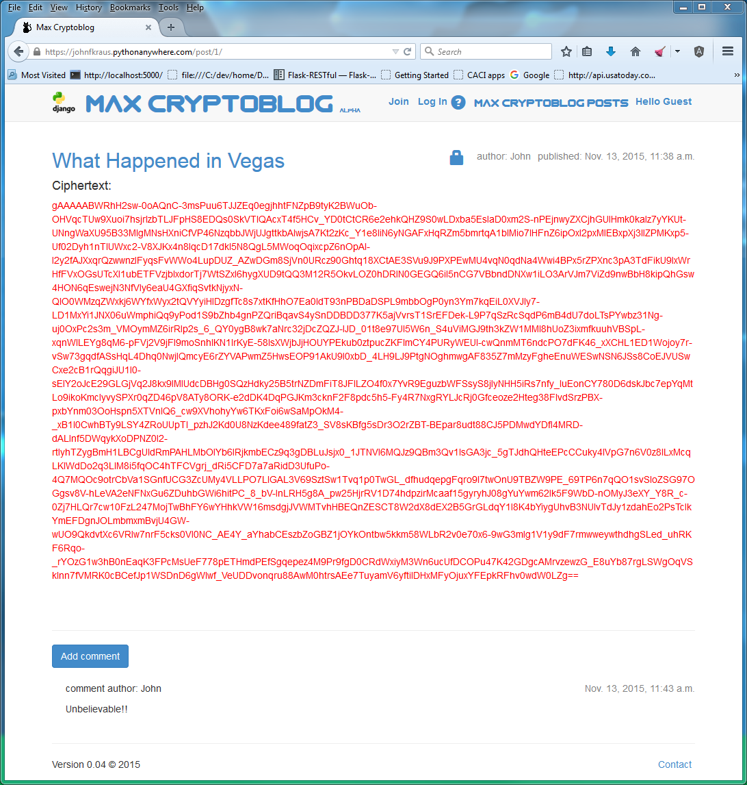

# Max Cryptoblog

A Python Django hobby application that lets you publish your web blog posts in cyphertext so that no one can read them. ;-)

I built this app while learning Python/Django.

What happened in Vegas?  It stays in Vegas unless you choose to share the password to your blog post about it.

You can view a pdf file of website screenshots.

<object data="max_cryptoblog_screenshots 6 pages ocr.pdf" type="application/pdf" width="700px" height="700px">
    <embed src="max_cryptoblog_screenshots 6 pages ocr.pdf">
        
This browser does not support PDFs. Please download the PDF to view it: <a href="max_cryptoblog_screenshots 6 pages ocr.pdf">Download PDF</a>.

    </embed>
</object>

TODO:

Allow encrypted posts to be download and saved to a local file.  The local file can then be emailed by the user.  The email recipient could then upload the emailed file to the blog and decrypt it using a password.

Allow use of PKI to encrypt messages between users (Bob and Alice, for example).

Allow unregistered recipients of encrypted emailed posts to decrypt them.

Users can uploaded and encrypted documents and images, including PDFs.

Notify administrator by email of new user registrations, conditions on the server, etc.

Add full-text search with, say, the django-haystack text search engine.

Add cool background images, like a one-time pad image. # done
